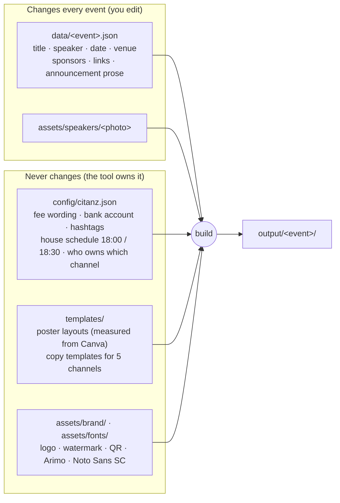
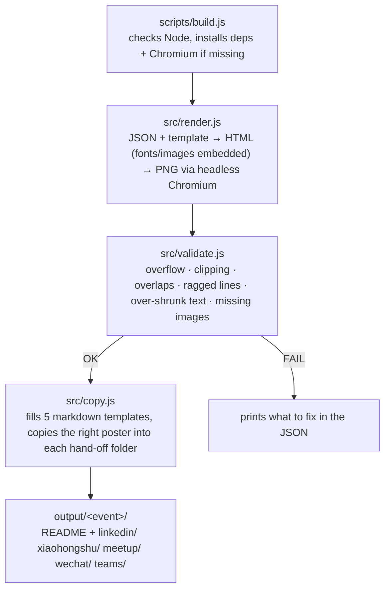
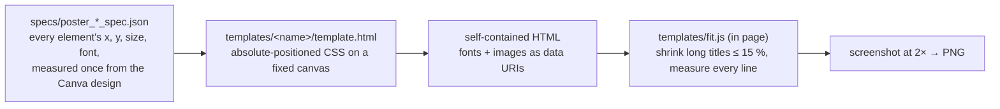
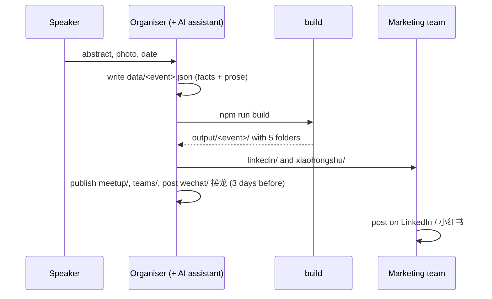
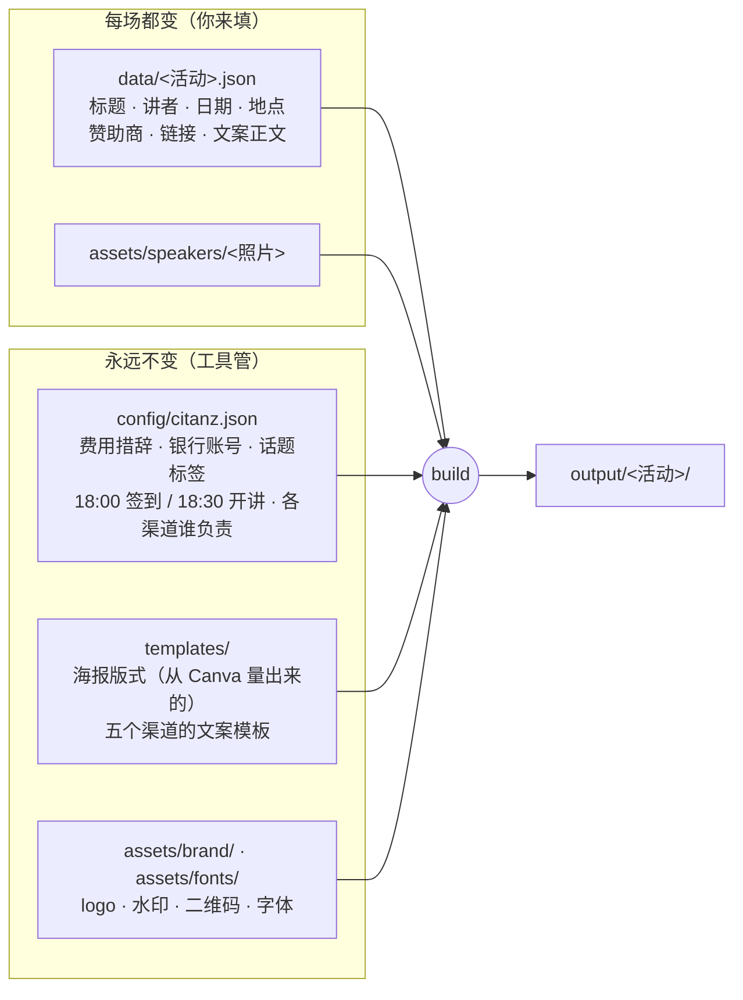
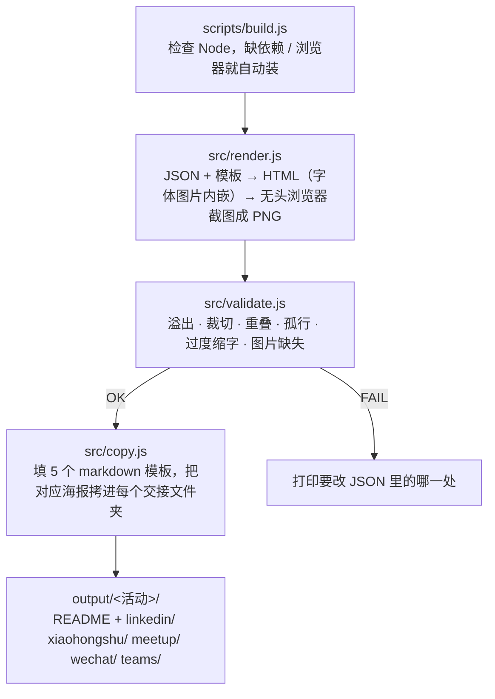
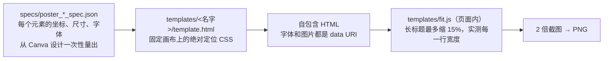
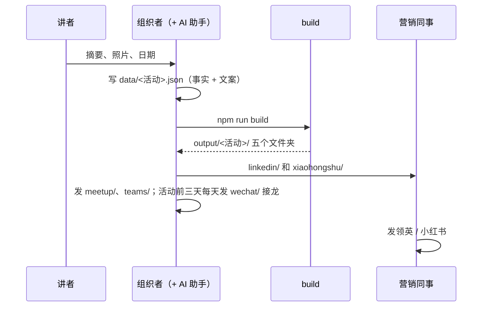

# citanz-meetup-generator

**One JSON file in → posters, announcements and a per-person hand-off pack out.**
Built for [CITANZ](https://www.citanz.org.nz/) meetup organisers, usable by anyone who runs recurring community events.

[中文说明在下半部分 ↓](#中文说明)

---

## What you get

Fill in one file (`data/<event>.json`), run one command, and you get:

| Output | Who uses it | Where |
|---|---|---|
| Landscape poster (EN, 1200×628) | LinkedIn, meetup.com | `output/<event>/*.landscape.png` |
| Portrait poster (ZH, 1587×2244) | 小红书, WeChat | `output/<event>/*.portrait.png` |
| LinkedIn post (EN) | marketing colleague | `output/<event>/linkedin/` |
| 小红书 post (ZH) | marketing colleague | `output/<event>/xiaohongshu/` |
| meetup.com event text (EN) | organiser | `output/<event>/meetup/` |
| WeChat 接龙 text, member + public versions (ZH) | organiser | `output/<event>/wechat/` |
| Teams webinar title + description | organiser | `output/<event>/teams/` |

Each folder already contains the right poster, so you can forward a folder to a person and they have everything.

## Quick start

```bash
git clone https://github.com/GabrielPower1969/citanz-meetup-generator.git
cd citanz-meetup-generator
npm run example          # first run installs dependencies + a headless browser (~100 MB), then builds the example
open output/2026-08-26-blockchain/
```

Needs Node 20+. Nothing else. Everything renders offline — no Canva, no Chrome, no network.

Prefer Docker? `docker compose run --rm build data/example.json` gives the same result.

## Make your own event

1. Copy `data/example.json` → `data/2026-10-15-my-topic-speaker-name.json` (the file name is also the output folder name: **date-topic-speaker**).
2. Put the speaker's photo in `assets/speakers/` (square, face centred — it becomes a circle). **A photo is mandatory.**
3. Fill in the facts: title, speaker, date, time, venue, sponsors, links.
4. Write (or let an AI assistant write) the announcement prose in the `copy` block — see `.claude/skills/meetup-copy/SKILL.md` for the voice rules per channel.
5. Build:
   ```bash
   npm run build data/2026-10-15-my-topic-speaker-name.json
   ```
6. If the build says **FAIL**, read the message: it tells you which text is too long or wraps badly. Fix the text, never the template.
7. Send `output/<event>/linkedin/` and `xiaohongshu/` to the marketing team; publish `meetup/`, `wechat/`, `teams/` yourself.

## How it is designed

### Layer 1 — what changes vs what never changes

The whole tool is built on one separation:



If something is the same at every meetup (the $5 fee line, the bank account, the 18:30 start), it lives in `config/` or `templates/`. If it changes per event, it lives in the event JSON. Nobody edits the templates for a single event.

### Layer 2 — the pipeline

`npm run build` runs three steps in order and stops at the first failure:



### Layer 3 — how a poster is made

Posters are **real HTML pages**, not image edits. Text stays text, so it can wrap, shrink and be checked.



Typography rules are enforced, not suggested: a wrapped block may not have a line narrower than 40 % of its widest line (no orphan words), and auto-fit may not shrink text more than 15 %. Both fail the build with a message that says *reword*, because a squeezed poster looks cheap.

### Layer 4 — who does what



## Using it with an AI assistant

The repo ships three skills in `.claude/skills/` (Claude Code loads them automatically; any other agent can read the same Markdown):

| Skill | What it does |
|---|---|
| `meetup-poster` | turns event facts into the two posters, knows the length limits |
| `meetup-copy` | writes the five announcements in the right voice per channel, then builds the hand-off pack |
| `meetup-publish` | the click-by-click recipe for publishing on meetup.com in a logged-in browser |

`CLAUDE.md` (also `AGENTS.md`) is the map of the repo for agents: commands, directory layout, invariants, how to verify.

Design principle: **fixed process = code, judgement = skill.** The assistant never re-derives how to install, render or validate; it only writes the prose and reads the validator's verdict.

## Directory map

```
data/            one JSON per event (schema.json documents every field; example.json is a complete sample)
config/          citanz.json — organisation constants
assets/          brand/ (locked) · fonts/ (self-hosted) · sponsors/ · speakers/
templates/       landscape/ portrait/ (poster HTML + meta) · copy/ (5 markdown templates) · fit.js
specs/           poster_*_spec.json — the measured design, source of truth for the templates
src/             render.js · validate.js · copy.js · lib.js
scripts/         build.js (self-installing pipeline) · setup.sh
reference/       design-analysis.md — how the Canva designs were measured, with evidence
output/          generated, git-ignored
```

## Adapting it for another community

1. Replace `assets/brand/*` and `config/citanz.json`.
2. Measure your own poster design into `specs/` (see `reference/design-analysis.md` for the method) and adjust the two templates.
3. Rewrite the fixed wording in `templates/copy/*.md`.
Everything else stays.

## Licence

MIT for the code. CITANZ and sponsor logos remain the property of their owners. Fonts: Arimo (Apache-2.0), Noto Sans SC (OFL).

---

# 中文说明

**一个 JSON 进，海报 + 五个渠道的文案 + 按人分好的交接包出。**
为 CITANZ 的 meetup 组织者做的，任何定期办社区活动的人都能用。

## 你会得到什么

填一个文件（`data/<活动>.json`），跑一条命令，得到：

| 产出 | 给谁 | 位置 |
|---|---|---|
| 横版英文海报 1200×628 | 领英、meetup.com | `output/<活动>/*.landscape.png` |
| 竖版中文海报 1587×2244 | 小红书、微信 | `output/<活动>/*.portrait.png` |
| 领英文案（英） | 营销同事 | `output/<活动>/linkedin/` |
| 小红书文案（中） | 营销同事 | `output/<活动>/xiaohongshu/` |
| meetup.com 活动文案（英） | 组织者 | `output/<活动>/meetup/` |
| 微信接龙文案，会员群 / 非会员群两版（中） | 组织者 | `output/<活动>/wechat/` |
| Teams 网络研讨会标题 + 描述 | 组织者 | `output/<活动>/teams/` |

每个文件夹里已经放好对应的海报，整个文件夹转发给对应的人就行。

## 快速开始

```bash
git clone https://github.com/GabrielPower1969/citanz-meetup-generator.git
cd citanz-meetup-generator
npm run example          # 第一次会自动装依赖和一个无头浏览器（约 100 MB），然后生成示例
open output/2026-08-26-blockchain/
```

只需要 Node 20+。生成过程完全离线——不依赖 Canva、不依赖 Chrome、不联网。
想用 Docker：`docker compose run --rm build data/example.json`，结果一样。

## 做一场新活动

1. 复制 `data/example.json` → `data/2026-10-15-主题-讲者.json`（文件名就是输出文件夹名：**日期-主题-讲者**）。
2. 讲者照片放进 `assets/speakers/`（正方形、脸在中间，会裁成圆形）。**照片必须有。**
3. 填事实：标题、讲者、日期、时间、地点、赞助商、链接。
4. 在 `copy` 块里写文案正文（或让 AI 助手写——各渠道的语气规则在 `.claude/skills/meetup-copy/SKILL.md`）。
5. 生成：
   ```bash
   npm run build data/2026-10-15-主题-讲者.json
   ```
6. 如果显示 **FAIL**，看提示：它会告诉你哪段文字太长或换行难看。改文字，不改模板。
7. `output/<活动>/linkedin/` 和 `xiaohongshu/` 发给营销同事；`meetup/`、`wechat/`、`teams/` 自己发。

## 它是怎么设计的

### 第一层：什么会变、什么永远不变

整个工具建立在一个划分上：



每场都一样的东西（$5 非会员费那句话、银行账号、18:30 开讲）放在 `config/` 或 `templates/`；每场不同的东西放在活动 JSON 里。没有人为了某一场去改模板。

### 第二层：流水线

`npm run build` 按顺序跑三步，哪步失败就停在哪步：



### 第三层：一张海报是怎么生成的

海报是**真正的网页**，不是改图。文字始终是文字，所以能自动换行、缩放、被检查。



排版规则是硬性的：换行后的文本块，任何一行不能窄于最宽行的 40%（不许出现孤零零几个字一行）；自动缩字号最多 15%。违反就 FAIL 并提示"改措辞"——挤出来的海报很难看。

### 第四层：谁做什么



## 配合 AI 助手使用

仓库自带三个 skill（`.claude/skills/`，Claude Code 自动加载，其他 agent 读同样的 Markdown 即可）：

| Skill | 做什么 |
|---|---|
| `meetup-poster` | 活动事实 → 两张海报，知道各处的字数上限 |
| `meetup-copy` | 按各渠道的语气写五份文案，然后生成交接包 |
| `meetup-publish` | 在已登录的浏览器里发布到 meetup.com 的逐步操作 |

`CLAUDE.md`（同 `AGENTS.md`）是给 agent 看的仓库地图：命令、目录、不变量、怎么验证。

设计原则：**固定流程写成代码，判断交给 skill。** 助手不需要每次推理怎么安装、渲染、校验；它只写文案、读校验结果。

## 换一个社区用

1. 换掉 `assets/brand/*` 和 `config/citanz.json`。
2. 把你自己的海报设计量进 `specs/`（方法见 `reference/design-analysis.md`），调整两个模板。
3. 改写 `templates/copy/*.md` 里的固定措辞。
其余不用动。
