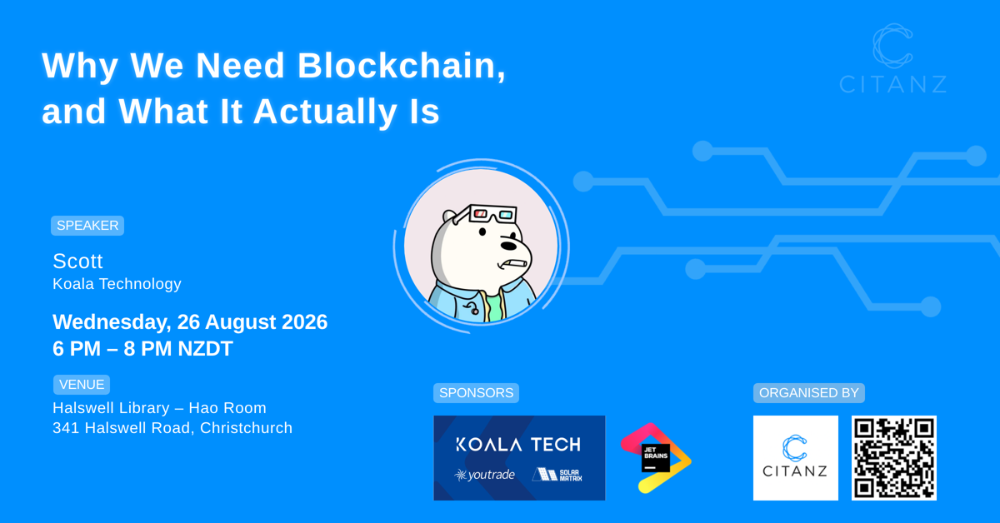
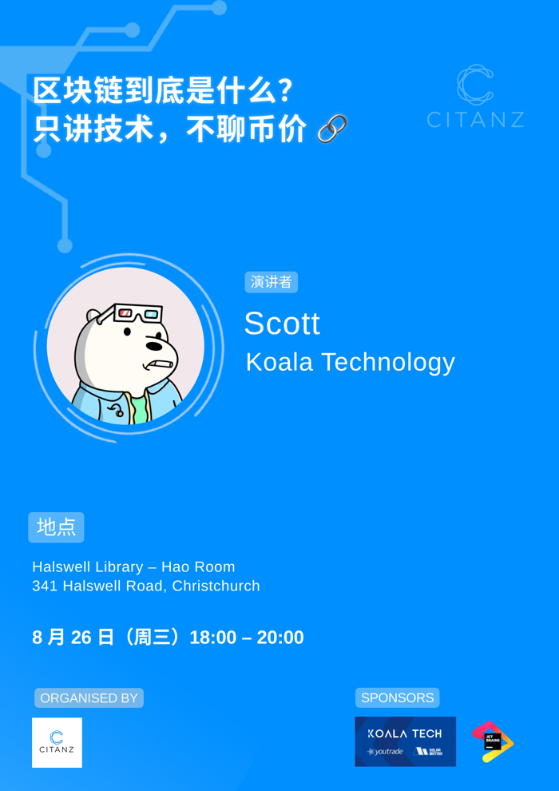
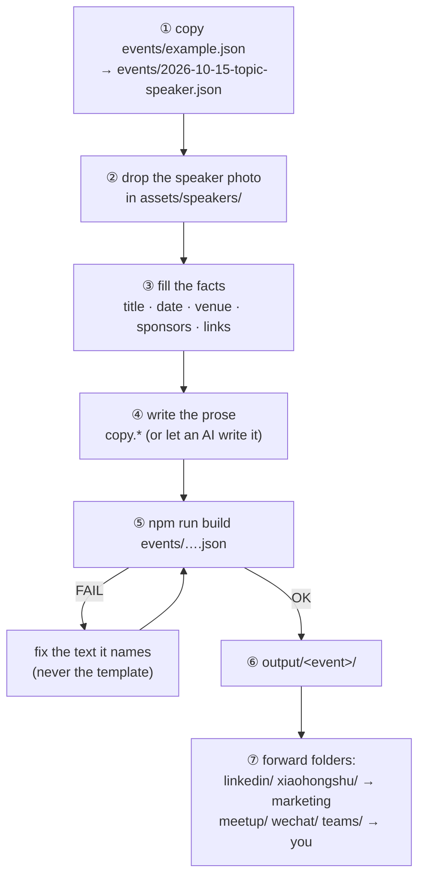
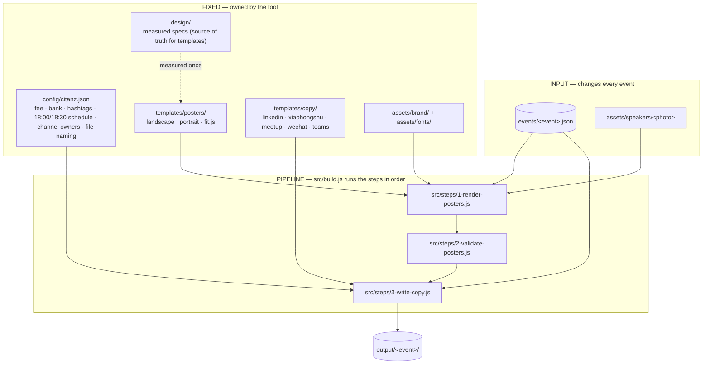

<div align="center">

# citanz-meetup-generator

**One event file in → two posters, five announcements, one hand-off folder per person out.**

[English](README.md) · [中文](README.zh-CN.md) · [Architecture](docs/ARCHITECTURE.md) · [Skills for AI assistants](.claude/skills/)

 &nbsp; 

*Both posters above were generated from `events/example.json` — no design tool involved.*

</div>

---

## Contents

1. [What it does](#1-what-it-does)
2. [Quick start](#2-quick-start)
3. [Make a real event](#3-make-a-real-event) — the 7 steps you repeat every meetup
4. [How it works in one picture](#4-how-it-works-in-one-picture)
5. [Folder map](#5-folder-map) — read this to know where things live
6. [Rules the tool enforces](#6-rules-the-tool-enforces)
7. [Using it with an AI assistant](#7-using-it-with-an-ai-assistant)
8. [Adapting it for another community](#8-adapting-it-for-another-community)

Deeper reading: [docs/ARCHITECTURE.md](docs/ARCHITECTURE.md) has the call graph, the data model (ERD), the mind map and the design decisions.

---

## 1. What it does

You describe one meetup in one JSON file. The tool produces everything you need to publicise it, already sorted by **who will post it**:

| Folder in `output/<event>/` | Give it to | Contains |
|---|---|---|
| `linkedin/` | marketing colleague | `领英-post-<topic>-<date>.md` + landscape poster |
| `xiaohongshu/` | marketing colleague | `小红书-post-<topic>-<date>.md` / `.txt` + poster on a 3:4 canvas (`.portrait.xhs.png`, 小红书's recommended ratio) |
| `meetup/` | you | `meetup-post-<topic>-<date>.md` (+ `.txt` to paste) + landscape poster |
| `wechat/` | you | `微信-本地会员群-post-…md` (#接龙), `微信-本地非会员群-post-…md` (#接龙 + $5 line), `微信-CITANZ大群-post-…md` (online-first, no address) + portrait poster |
| `teams/` | you | `Teams-post-<topic>-<date>.md` + landscape poster |
| `report/` | you + marketing | post-event `复盘-post-<topic>-<date>.md` (numbers with provenance, quotes, observations, next actions) — after `npm run report` |
| `README.md` | — | who gets which folder |

## 2. Quick start

```bash
git clone https://github.com/GabrielPower1969/citanz-meetup-generator.git
cd citanz-meetup-generator
npm run example          # first run installs dependencies + a headless browser (~100 MB), then builds the example
open output/2026-08-26-blockchain/
```

Needs **Node 20+** and nothing else. Rendering is fully offline: no Canva, no Chrome, no network.
Docker instead: `docker compose run --rm build events/example.json`.

## 3. Make a real event



- The file name **is** the output folder name: `<date>-<topic>-<speaker>`. The `topic` field names the copy files.
- A speaker photo is mandatory (square, face centred; it becomes a circle).
- Voice rules per channel for step ④: [`.claude/skills/meetup-copy/SKILL.md`](.claude/skills/meetup-copy/SKILL.md).
- `[TODO field]` inside an output file means you forgot that field; the build also fails so you can't ship it by accident.

## 4. How it works in one picture



Read it top to bottom: **inputs** you edit, **fixed** things you don't, a **numbered pipeline** that stops at the first failure, one **output** folder. The folder names in the repo follow the same order.

## 5. Folder map

```
events/      ← START HERE. One JSON per event. example.json is a complete sample; schema.json documents every field.
config/      Organisation constants (fee wording, bank account, hashtags, house schedule, channel owners, file naming).
assets/      brand/ (locked design elements) · fonts/ (self-hosted) · sponsors/ · speakers/
templates/   posters/  HTML + CSS per poster size, plus fit.js (auto-fit + line measurement)
             copy/     one Markdown template per channel
design/      The measured Canva specs + how they were measured. Change these before touching a template.
src/         build.js (entry) → steps/1-… 2-… 3-… (numbered = execution order) → lib/ (shared helpers)
scripts/     setup.sh (one-time bootstrap; build.js also self-installs)
docs/        ARCHITECTURE.md, preview images
output/      Generated, git-ignored. One folder per event.
.claude/     skills/ — the workflows an AI assistant follows (poster · copy · publish)
```

## 6. Rules the tool enforces

These are checked by `2-validate-posters.js`, not left to taste:

| Rule | Why |
|---|---|
| No line narrower than 40 % of the widest line in a wrapped block | one or two orphan words on a line look cheap |
| Auto-fit may shrink text by at most 15 % | beyond that the hierarchy collapses — reword instead |
| Nothing overflows the canvas, no text overlaps another block or the photo | obvious, but easy to miss on a long venue name |
| Speaker photo required, all images must load | a poster with a broken image must not ship |
| Every `{{field}}` must resolve | `[TODO …]` fails the build |

House rules (fee, 18:00 doors / 18:30 start, thank-you line, hashtags) live in `config/citanz.json` and are stamped into the copy automatically.

## 7. Using it with an AI assistant

Three skills in `.claude/skills/` (Claude Code loads them automatically; other agents read the same Markdown):

| Skill | Does |
|---|---|
| `meetup-poster` | event facts → two posters; knows the length limits |
| `meetup-copy` | speaker notes → five announcements in the right voice; builds the hand-off pack |
| `meetup-publish` | click-by-click recipe for meetup.com in a logged-in browser (create, announce, change venue) |
| `xiaohongshu-publish` | click-by-click recipe for 小红书 creator platform: 3:4 image, 20-char title, 1000-char body, 10 topics |
| `event-analytics` | post-event 复盘: where to read each number (LinkedIn analytics, meetup attendees, 小红书 数据, WeChat 接龙, Teams), quotes verbatim, then `npm run report` |

[`CLAUDE.md`](CLAUDE.md) (= `AGENTS.md`) is the agent's map: commands, invariants, how to verify.
Principle: **fixed process is code, judgement is a skill.** The assistant never re-derives how to install, render or validate; it writes prose and reads the validator's verdict.

## 8. Adapting it for another community

1. Replace `assets/brand/*` and `config/citanz.json`.
2. Measure your poster design into `design/` (method: [`design/how-the-canva-design-was-measured.md`](design/how-the-canva-design-was-measured.md)) and adjust `templates/posters/`.
3. Rewrite the fixed wording in `templates/copy/*.md`.

Everything else stays.

## Licence

MIT for the code. CITANZ and sponsor logos remain the property of their owners. Fonts: Arimo (Apache-2.0), Noto Sans SC (OFL).
