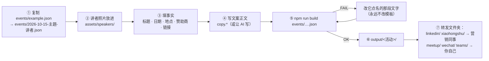
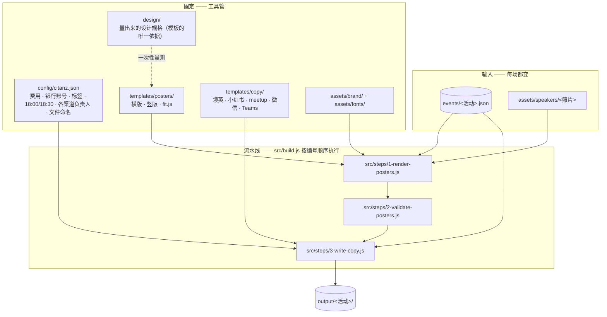

<div align="center">

# citanz-meetup-generator

**一个活动文件进 → 两张海报、五份文案、按人分好的交接文件夹出。**

[English](README.md) · [中文](README.zh-CN.md) · [架构说明](docs/ARCHITECTURE.zh-CN.md) · [给 AI 助手的 skill](.claude/skills/)

 &nbsp; 

*上面两张海报都是从 `events/example.json` 生成的，没有用任何设计软件。*

</div>

---

## 目录

1. [它做什么](#1-它做什么)
2. [快速开始](#2-快速开始)
3. [做一场真实活动](#3-做一场真实活动) — 每次 meetup 重复的 7 步
4. [一张图看懂原理](#4-一张图看懂原理)
5. [目录地图](#5-目录地图) — 看这里知道东西放在哪
6. [工具强制执行的规则](#6-工具强制执行的规则)
7. [配合 AI 助手使用](#7-配合-ai-助手使用)
8. [换一个社区用](#8-换一个社区用)

深入阅读：[docs/ARCHITECTURE.zh-CN.md](docs/ARCHITECTURE.zh-CN.md) 有调用关系图、数据模型（ERD）、思维导图和设计决策。

---

## 1. 它做什么

你用一个 JSON 描述一场 meetup，工具产出所有宣传材料，并且**按"谁去发"分好文件夹**：

| `output/<活动>/` 里的文件夹 | 给谁 | 内容 |
|---|---|---|
| `linkedin/` | 营销同事 | `领英-post-<主题>-<日期>.md` + 横版海报 |
| `xiaohongshu/` | 营销同事 | `小红书-post-<主题>-<日期>.md` + 竖版海报 |
| `meetup/` | 你 | `meetup-post-<主题>-<日期>.md`（+ 可直接粘贴的 `.txt`）+ 横版海报 |
| `wechat/` | 你 | `微信-会员群-post-…md`、`微信-非会员群-post-…md` + 竖版海报 |
| `teams/` | 你 | `Teams-post-<主题>-<日期>.md` + 横版海报 |
| `README.md` | — | 哪个文件夹给谁 |

## 2. 快速开始

```bash
git clone https://github.com/GabrielPower1969/citanz-meetup-generator.git
cd citanz-meetup-generator
npm run example          # 第一次会自动装依赖和一个无头浏览器（约 100 MB），然后生成示例
open output/2026-08-26-blockchain/
```

只需要 **Node 20+**，别的都不用。生成完全离线：不依赖 Canva、不依赖 Chrome、不联网。
用 Docker 也行：`docker compose run --rm build events/example.json`。

## 3. 做一场真实活动



- 文件名**就是**输出文件夹名：`<日期>-<主题>-<讲者>`。`topic` 字段决定文案文件名。
- 讲者照片必须有（正方形、脸居中，会裁成圆形）。
- 第 ④ 步各渠道的语气规则见 [`.claude/skills/meetup-copy/SKILL.md`](.claude/skills/meetup-copy/SKILL.md)。
- 输出文件里出现 `[TODO 字段名]` 表示你漏填了；build 同时会失败，不会误发半成品。

## 4. 一张图看懂原理



从上往下读：你编辑的**输入**，你不碰的**固定**部分，**带编号的流水线**（哪步失败就停在哪步），一个**输出**文件夹。仓库里的目录名和这张图一一对应。

## 5. 目录地图

```
events/      ← 从这里开始。一个活动一个 JSON。example.json 是完整样例；schema.json 解释每个字段。
config/      组织级常量（费用措辞、银行账号、标签、时间规则、渠道负责人、文件命名规则）。
assets/      brand/（锁定的品牌元素）· fonts/（自托管字体）· sponsors/ · speakers/
templates/   posters/  每种海报尺寸一套 HTML + CSS，加 fit.js（自动缩放 + 逐行量宽）
             copy/     每个渠道一个 Markdown 模板
design/      从 Canva 量出来的规格 + 量测方法。改模板前先改这里。
src/         build.js（入口）→ steps/1-… 2-… 3-…（编号 = 执行顺序）→ lib/（公共函数）
scripts/     setup.sh（首次引导；build.js 本身也会自动装依赖）
docs/        ARCHITECTURE、预览图
output/      生成物，git 忽略。一个活动一个文件夹。
.claude/     skills/ —— AI 助手遵循的工作流（海报 · 文案 · 发布）
```

## 6. 工具强制执行的规则

这些由 `2-validate-posters.js` 检查，不靠人眼：

| 规则 | 为什么 |
|---|---|
| 换行后的文本块，任何一行不能窄于最宽行的 40% | 一行只剩一两个字很难看 |
| 自动缩字号最多 15% | 再缩层级就塌了——改措辞 |
| 不溢出画布，文字不压别的块、不压头像 | 场地名一长就容易中招 |
| 讲者照片必须有，所有图片必须加载成功 | 图片坏掉的海报不能发出去 |
| 每个 `{{字段}}` 必须有值 | `[TODO …]` 直接让 build 失败 |

组织级规则（费用、18:00 签到 / 18:30 开讲、致谢句、标签）放在 `config/citanz.json`，自动盖进文案。

## 7. 配合 AI 助手使用

`.claude/skills/` 里三个 skill（Claude Code 自动加载，其他 agent 读同样的 Markdown 即可）：

| Skill | 做什么 |
|---|---|
| `meetup-poster` | 活动事实 → 两张海报；知道各处字数上限 |
| `meetup-copy` | 讲者材料 → 五份文案，按渠道语气；生成交接包 |
| `meetup-publish` | 在已登录的浏览器里发布到 meetup.com 的逐步操作 |

[`CLAUDE.md`](CLAUDE.md)（同 `AGENTS.md`）是给 agent 的地图：命令、不变量、怎么验证。
原则：**固定流程是代码，判断是 skill。** 助手不需要每次推理怎么安装、渲染、校验；它只写文案、读校验结果。

## 8. 换一个社区用

1. 换掉 `assets/brand/*` 和 `config/citanz.json`。
2. 把你的海报设计量进 `design/`（方法见 [`design/how-the-canva-design-was-measured.md`](design/how-the-canva-design-was-measured.md)），调整 `templates/posters/`。
3. 改写 `templates/copy/*.md` 里的固定措辞。

其余不用动。

## 许可

代码 MIT。CITANZ 和赞助商 logo 归各自所有者。字体：Arimo（Apache-2.0）、Noto Sans SC（OFL）。
