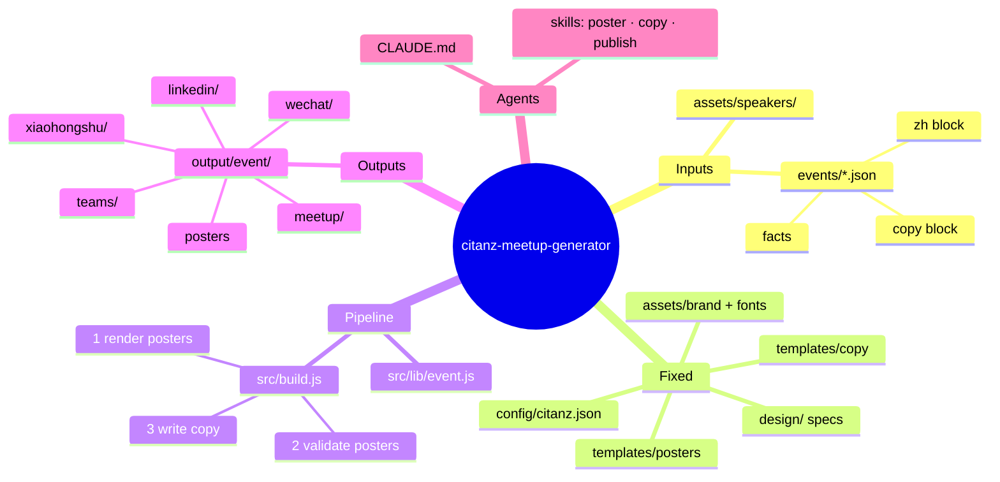
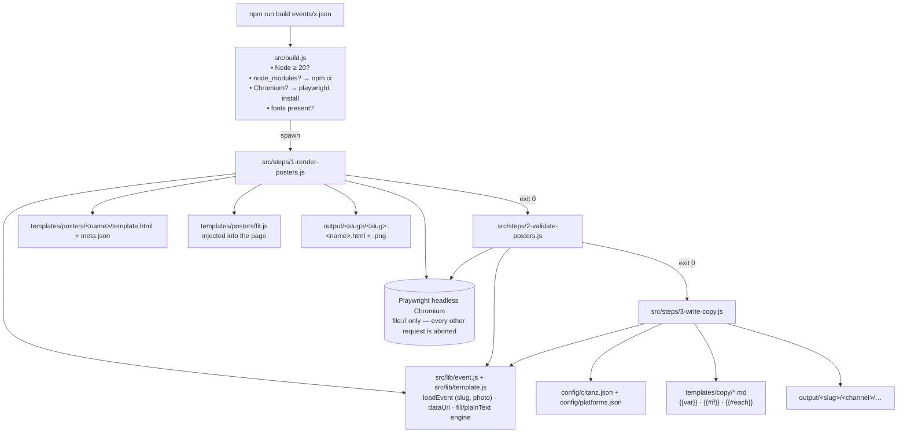
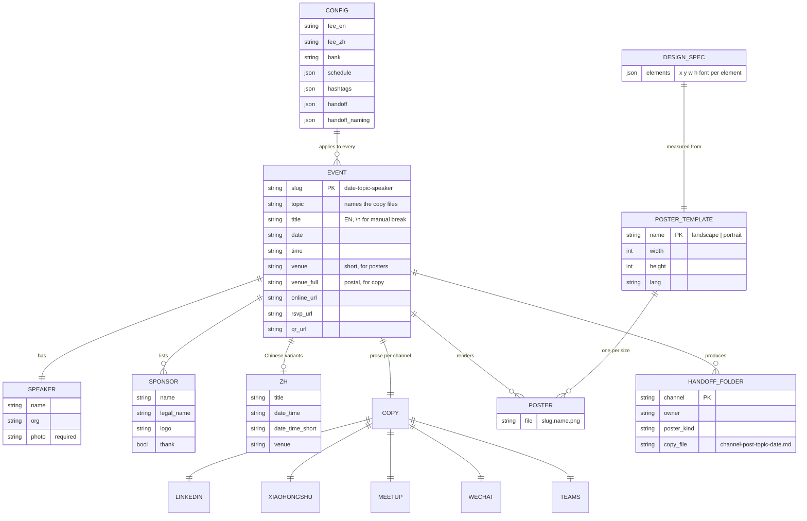
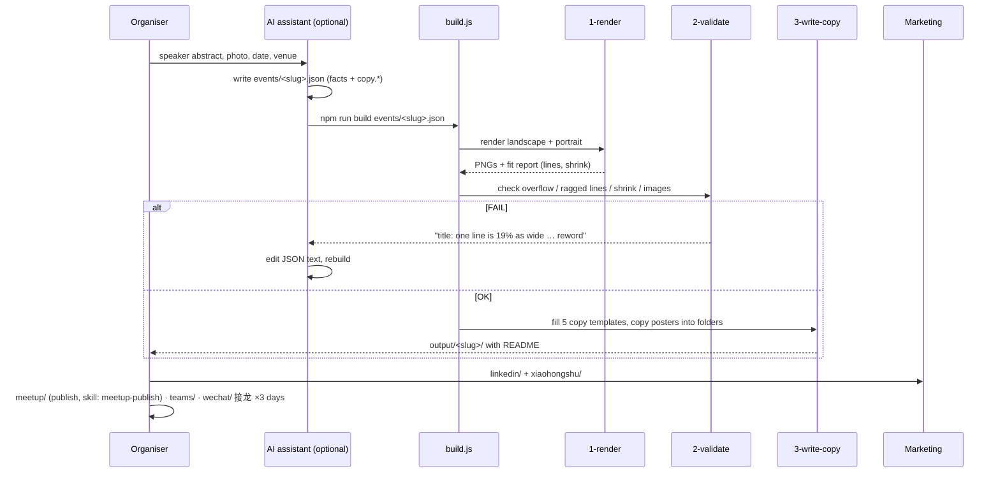

# Architecture

[中文版](ARCHITECTURE.zh-CN.md)

This page is for anyone who needs to change the tool, not just use it. It answers four questions: what calls what, what the data looks like, what the design decisions were, and how to verify a change.

## 1. Mind map

## 2. Call graph

Each step is a standalone script with the same argument (`events/<event>.json`), so any step can be re-run alone: `npm run render|validate|copy events/x.json`.

## 3. Data model (ERD)

`events/schema.json` is the machine-readable version of `EVENT`.

## 4. Sequence per event

## 5. Design decisions

| Decision | Alternative rejected | Why |
|---|---|---|
| Posters are HTML rendered by a bundled headless browser | Canva API / Pillow drawing | real text wraps, shrinks and can be measured; no account, no network; identical on every machine |
| Geometry lives in `design/*.json`, measured once from Canva | eyeballing a screenshot | numbers with evidence beat guesses; the template is a transcription, not a design |
| Typography rules are validator failures, not advice | let the LLM judge | the rule is objective (40 % / 15 %) and a failed build is impossible to ignore |
| Fixed wording in `config/` + `templates/copy/`, prose in the event JSON | LLM writes whole posts | bank account, fee, schedule never drift; the LLM only writes what actually changes |
| Output grouped **by recipient**, files named `<channel>-post-<topic>-<date>` | grouped by type | a folder is forwarded to one person; the file name survives being downloaded out of context |
| `build.js` self-installs | README instructions | an AI assistant should not spend tokens on setup |
| Real events and speaker photos are git-ignored | commit everything | the repo is shared publicly; only the example is public |

## 6. How to verify a change

| You changed | Run | Look at |
|---|---|---|
| a poster template or `design/` spec | `npm run example` | `docs/images` vs `output/2026-08-26-blockchain/*.png`; validator must print OK |
| `fit.js` or the validator | `npm run example` plus a deliberately long title | the FAIL message must name the block and the reason |
| a copy template or `config/` | `npm run copy events/example.json` | no `[TODO …]`; diff the Markdown |
| `build.js` | delete `node_modules`, run `npm run example` | it reinstalls and finishes |

## 7. Extending

- **New poster size**: add `templates/posters/<name>/{template.html,meta.json}`; it is picked up automatically (`listTemplates`). Measure its spec into `design/` first.
- **New channel**: add `templates/copy/<channel>.md`, a `handoff.<channel>` entry and a `handoff_naming.channel_labels.<channel>` label in `config/citanz.json`, and one `write(...)`/`attach(...)` pair in `3-write-copy.js`.
- **New house rule**: put it in `config/citanz.json` and read it in `3-write-copy.js`; document it in `CLAUDE.md` invariants.
