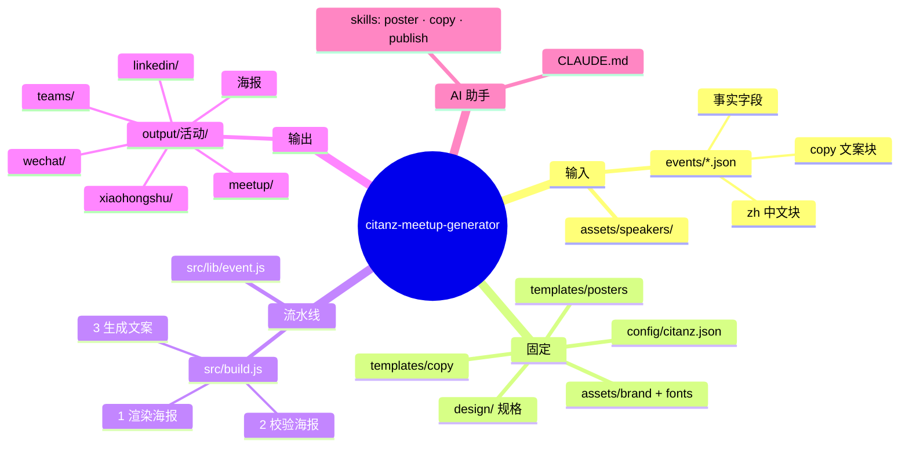
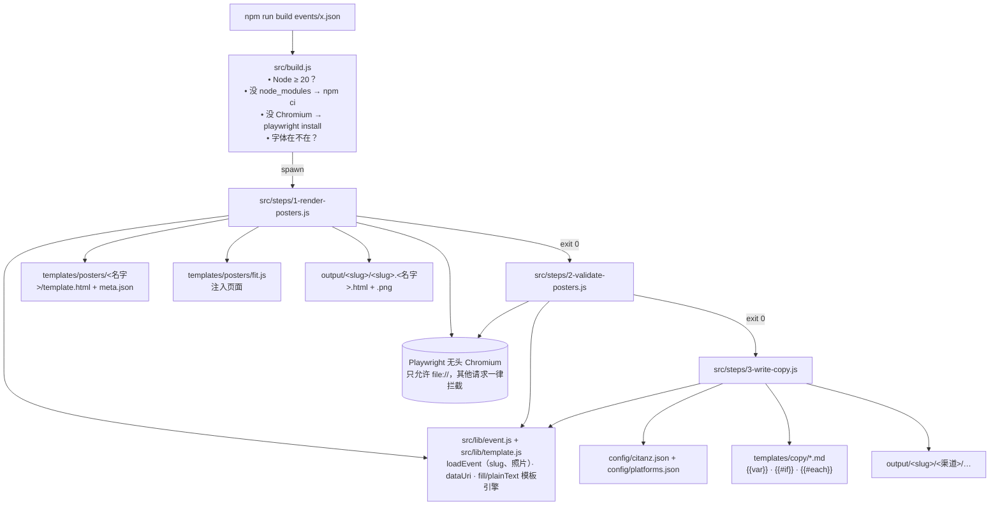
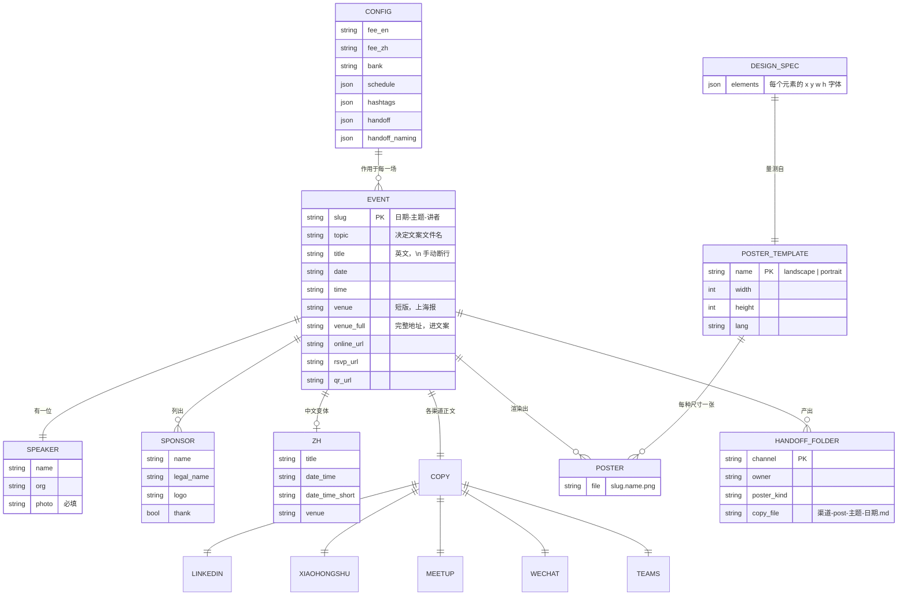
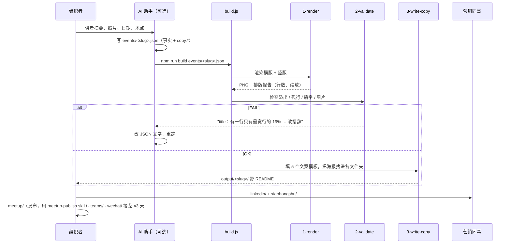

# 架构说明

[English](ARCHITECTURE.md)

这页给要**改**工具的人看，不只是用的人。回答四个问题：谁调用谁、数据长什么样、为什么这样设计、改完怎么验证。

## 1. 思维导图

## 2. 调用关系

三步都是独立脚本，参数相同（`events/<活动>.json`），可以单独重跑：`npm run render|validate|copy events/x.json`。

## 3. 数据模型（ERD）

`events/schema.json` 是 `EVENT` 的机器可读版本。

## 4. 一场活动的时序

## 5. 设计决策

| 决定 | 放弃的方案 | 原因 |
|---|---|---|
| 海报是 HTML，用自带的无头浏览器渲染 | Canva API / Pillow 画图 | 真文字能换行、缩放、量宽；不要账号不联网；每台机器结果一致 |
| 几何数据放 `design/*.json`，从 Canva 一次性量出 | 看截图目测 | 有证据的数字胜过猜测；模板是誊抄，不是再设计 |
| 排版规则是校验失败，不是建议 | 让 LLM 自己判断 | 规则客观（40% / 15%），build 失败没法忽略 |
| 固定措辞在 `config/` + `templates/copy/`，正文在活动 JSON | LLM 写整篇 | 银行账号、费用、时间永不漂移；LLM 只写真正会变的部分 |
| 输出**按接收人**分组，文件名 `<渠道>-post-<主题>-<日期>` | 按类型分组 | 一个文件夹转给一个人；文件被单独下载后名字仍然自解释 |
| `build.js` 自动装环境 | README 写安装步骤 | AI 助手不该把 token 花在装环境上 |
| 真实活动和讲者照片不入库 | 全部提交 | 仓库公开；只有示例是公开的 |

## 6. 改完怎么验证

| 你改了 | 跑 | 看 |
|---|---|---|
| 海报模板或 `design/` 规格 | `npm run example` | `docs/images` 对比 `output/2026-08-26-blockchain/*.png`；校验必须 OK |
| `fit.js` 或校验器 | `npm run example` + 故意塞一个超长标题 | FAIL 信息必须点名是哪个块、什么原因 |
| 文案模板或 `config/` | `npm run copy events/example.json` | 没有 `[TODO …]`；diff Markdown |
| `build.js` | 删掉 `node_modules` 再 `npm run example` | 它要能自己装回来并跑完 |

## 7. 扩展

- **新海报尺寸**：加 `templates/posters/<名字>/{template.html,meta.json}`，会被自动发现（`listTemplates`）。先把规格量进 `design/`。
- **新渠道**：加 `templates/copy/<渠道>.md`，在 `config/citanz.json` 加 `handoff.<渠道>` 和 `handoff_naming.channel_labels.<渠道>`，在 `3-write-copy.js` 加一对 `write(...)`/`attach(...)`。
- **新组织规则**：写进 `config/citanz.json`，在 `3-write-copy.js` 读取；在 `CLAUDE.md` 的不变量里记一笔。
